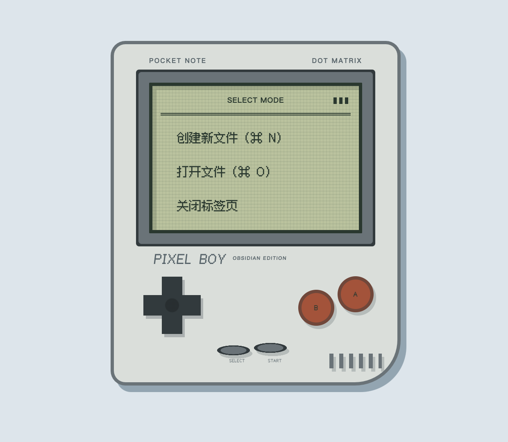
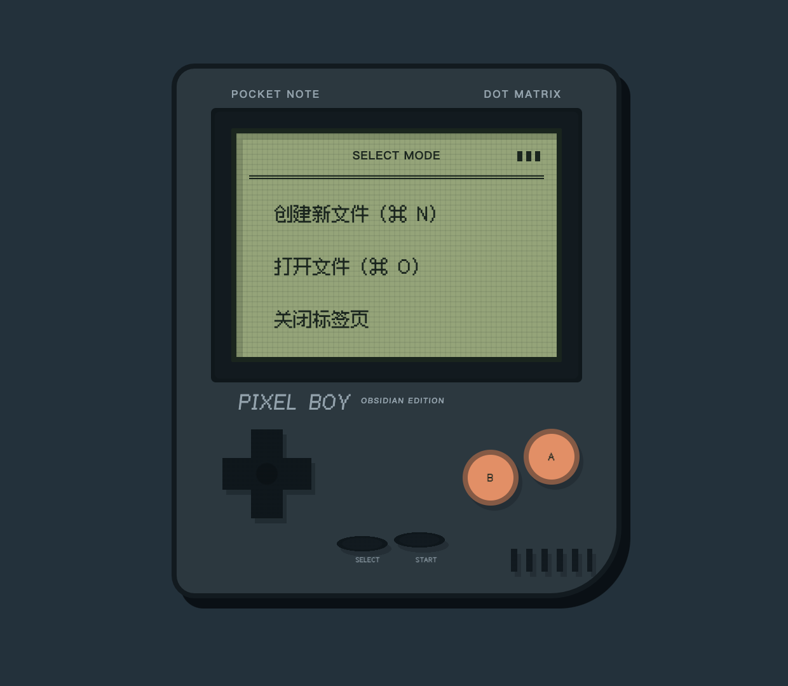

<h1 align="center">P I X E L</h1>

<p align="right">English · <a href="README.zh-CN.md">中文</a></p>

<p align="center">
  <strong>Pixels on paper · Focused writing</strong><br>
  A distinctive Obsidian theme for long-form writing and knowledge work
</p>

<p align="center">
  
</p>

<p align="center">
  <kbd><!-- pixel-version:start -->0.9.6<!-- pixel-version:end --></kbd>
  <kbd>OBSIDIAN 1.12+</kbd>
  <kbd>LIGHT / DARK</kbd>
  <kbd>DESKTOP / iOS</kbd>
</p>

<p align="center">
  <a href="#pixel-boy">Pixel Boy</a> ·
  <a href="#feature-map">Feature map</a> ·
  <a href="#gallery">Gallery</a> ·
  <a href="#installation">Installation</a> ·
  <a href="#development">Development</a>
</p>

<p align="center">
  
</p>

<p align="center"><sub>Desktop Light / Dark and iOS · Composed from real Obsidian captures</sub></p>

Pixel gives Obsidian a calm paper workspace, a crisp pixel identity, and a
clear signal system for navigation and focus. It is not a retro filter: body
text stays comfortable for long sessions, native interactions remain intact,
and personality is concentrated where it helps orientation.

Desktop and iOS are the priority platforms. Both receive purpose-built layouts
for Markdown, properties, navigation, Bases, Canvas, Graph, PDF, and the small
states that make a workspace feel coherent.

## Pixel Boy

### A new tab with somewhere to go

A blank tab becomes a pocket console. Obsidian's native **Create**, **Open**,
and **Close** actions stay fully functional inside a dot-matrix display, while
the shell, D-pad, face buttons, power light, and speaker complete the handheld.

<table>
  <tr>
    <td align="center"><strong>LIGHT · PAPER SHELL</strong></td>
    <td align="center"><strong>DARK · OBSIDIAN SHELL</strong></td>
  </tr>
  <tr>
    <td></td>
    <td></td>
  </tr>
</table>

<p align="center">
  <sub>Native actions · Responsive geometry · Light / Dark palettes · Accessible fallback modes</sub>
</p>

The console contracts for narrow panes without turning decoration into an
interaction layer. Keyboard shortcuts, pointer targets, forced colors, and
reduced-motion preferences continue to belong to Obsidian.

## Feature map

<table>
  <tr>
    <td width="50%" valign="top">
      <strong>PAPER-FIRST WRITING</strong><br><br>
      A quiet surface hierarchy, readable body stack, and <code>72ch</code>
      default measure keep long Markdown documents spacious without making the
      interface anonymous.
    </td>
    <td width="50%" valign="top">
      <strong>SIGNAL-LED NAVIGATION</strong><br><br>
      Cyan marks the current path and keyboard focus, amber carries context,
      and brick identifies warning or danger. State is reinforced by geometry,
      not color alone.
    </td>
  </tr>
  <tr>
    <td width="50%" valign="top">
      <strong>KNOWLEDGE SURFACES</strong><br><br>
      Properties, Bases, Canvas, Graph, PDF, embeds, tables, code, tags, and
      tasks share one visual grammar while preserving their native behavior.
    </td>
    <td width="50%" valign="top">
      <strong>POCKET INTERFACE</strong><br><br>
      iOS navigation, drawers, properties, safe areas, and touch targets are
      rebalanced for the device instead of being a shrunken desktop layout.
    </td>
  </tr>
  <tr>
    <td width="50%" valign="top">
      <strong>CLAUDIAN INTEGRATION</strong><br><br>
      The assistant conversation, composer, context chips, sessions, and
      settings tabs receive a focused Pixel treatment with narrow-pane and
      keyboard support.
    </td>
    <td width="50%" valign="top">
      <strong>NATIVE CONTRACT</strong><br><br>
      Pixel does not replace Obsidian's editing, folding, scrolling, gestures,
      drawers, icons, or media controls. Familiar mechanics remain familiar.
    </td>
  </tr>
</table>

## Gallery

### Desktop · one continuous work surface

Navigation lives on the left, the note keeps the center, and context settles
on the right. The compact status pod follows the live right-dock width so the
workspace reads as one deliberate console rather than a stack of panels.

<details>
<summary><strong>Open the complete Light and Dark comparison</strong></summary>

<br>

<table>
  <tr>
    <td align="center"><strong>LIGHT</strong></td>
    <td align="center"><strong>DARK</strong></td>
  </tr>
  <tr>
    <td></td>
    <td></td>
  </tr>
</table>

</details>

## Visual language

<p align="center">
  
</p>

| Role | What it communicates |
| --- | --- |
| **Paper** | Notes, menus, settings cards, and primary reading surfaces. |
| **Canvas** | The cool workspace around content and secondary regions. |
| **Cyan** | Active navigation, links, caret, controls, and keyboard focus. |
| **Amber** | Properties, attached context, emphasis, and attention. |
| **Brick** | Errors, warnings, destructive actions, and the Pixel Boy controls. |
| **4 / 6 / 10px radii** | Pixel structure at small sizes and comfortable touch geometry at larger sizes. |

Light and Dark use independently tuned semantic colors rather than simple
inversion. Normal text, secondary text, focus indicators, and meaningful
control boundaries are designed against accessible contrast targets.

## Built across Obsidian

<details>
<summary><strong>Markdown writing</strong></summary>

- Consistent heading rhythm across Source, Live Preview, and Reading modes.
- Links, emphasis, lists, quotes, tasks, continuous tag capsules, highlights,
  footnotes, math, and comments.
- Local overflow for code, tables, embeds, and media without compressing the
  full note.
- Clear selection, caret, active line, folding, and indentation states.

</details>

<details>
<summary><strong>Knowledge management</strong></summary>

- File navigation, tags, search, bookmarks, outline, backlinks, and outgoing
  links.
- Note properties and property suggestions, including iOS editing states.
- Global and Local Graph controls and semantic states.
- Canvas cards, groups, media, edges, selection, and editing.
- Bases tables, lists, cards, filters, sorting, and property editing.
- PDF chrome, sidebar, thumbnails, search, and selection while preserving
  document pixels.

</details>

<details>
<summary><strong>Settings and accessibility</strong></summary>

- Independent setting cards, stable hover and focus feedback, compact native
  controls, and a circular accent-color well.
- Normal text targets at least `4.5:1` contrast; meaningful icons and control
  boundaries target at least `3:1`.
- Keyboard focus uses outline, surface, and position cues instead of color
  alone.
- Reduced motion, forced colors, and increased contrast preferences are
  supported.
- User fonts, font sizes, accent, selection, and caret settings remain
  authoritative.

</details>

## Installation

Pixel entered public beta with `0.9.0`. Once the official directory review is
complete:

1. Open **Settings → Appearance** in Obsidian.
2. Select **Manage** under Themes.
3. Search for **Pixel**, install it, and select **Use**.

Future public versions are delivered through Obsidian's built-in theme updater
from matching GitHub Releases.

### Manual installation

1. Download [`manifest.json`](manifest.json) and [`theme.css`](theme.css).
2. Create `.obsidian/themes/Pixel/` in the target Vault.
3. Put both files in that directory.
4. Restart Obsidian if necessary, then select **Pixel** under Appearance.

For a synced Vault on iOS, wait for `.obsidian/themes/Pixel/` to finish syncing
before restarting Obsidian.

## Customization

Pixel respects Obsidian's own appearance settings without requiring a
companion plugin:

- Light or Dark mode
- Text and interface fonts
- Base font size
- Accent color

Pixel does not currently expose custom **Style Settings** controls. The Style
Settings plugin is optional and is not required to install, use, or customize
the theme.

Fusion Pixel is embedded for identity headings. Code and technical status use
Obsidian's configured monospace font with system fallbacks, while body text
uses the user's text font and operating-system fallback for uncommon
characters.

Pixel includes focused visual integrations for Claudian, Project Manager, and
Project Manager Insights. Other plugins that use official Obsidian variables
and Setting components generally inherit the theme naturally, but individual
community plugins are not compatibility commitments unless named here.

## Compatibility

| Item | Current information |
| --- | --- |
| Current version | <code><!-- pixel-version:start -->0.9.6<!-- pixel-version:end --></code> |
| Obsidian requirement | `1.12.0` or newer |
| Priority platforms | Desktop / iOS |
| Verified desktop environment | Obsidian `1.13.4` / macOS |
| Appearance modes | Light / Dark |
| Installable files | `manifest.json`, `theme.css` |
| Theme license | MIT |
| Embedded font license | SIL Open Font License 1.1 |

## Development

Pixel requires Node.js 24 and npm:

```sh
npm ci
npm run build
npm test
npm run check
```

- `npm run build` compiles `theme.css` and optionally deploys to the dedicated
  development Vault.
- `npm run dev` watches Sass sources.
- `npm test` runs structural, compatibility, and release-contract tests.
- `npm run check` verifies that generated output matches the source without
  modifying it.

`src/scss/index.scss` is the only Sass entry point. Edit sources under `src/`;
do not edit generated `theme.css` directly.

For guarded deployment, see [the Chinese development details](README.zh-CN.md#开发).

## Releasing

- `manifest.json` is the authoritative current version.
- `versions.json` permanently maps every published theme version to its minimum
  Obsidian version.
- Only an unprefixed `x.y.z` annotated tag triggers release CI.
- A verified release publishes only `theme.css` and `manifest.json`, with
  GitHub build provenance attestations.
- Public tags, Releases, and assets are immutable; regressions are fixed
  forward with a new PATCH.

See the complete [release and Obsidian community update guide](docs/RELEASING.md).

## Feedback

Use [GitHub Issues](https://github.com/CoffeeCheese/obsidian-pixel-theme/issues)
for public feedback. Include Pixel and Obsidian versions, operating system,
Light or Dark mode, reproduction steps, screenshots, and any enabled CSS
snippets or community plugins.

## License

Pixel is released under the [MIT License](LICENSE). The embedded Fusion Pixel
font retains its SIL Open Font License 1.1 terms; source, checksum, and license
details are available under [`src/assets/fonts/`](src/assets/fonts/).
