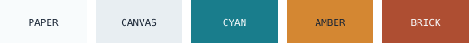
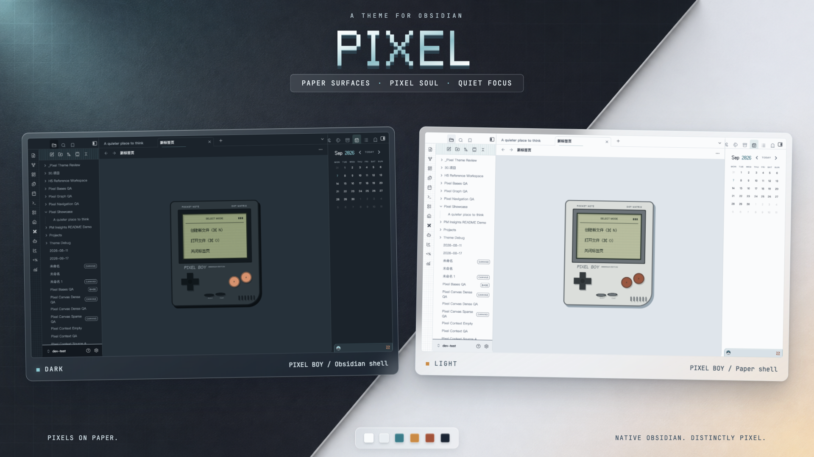
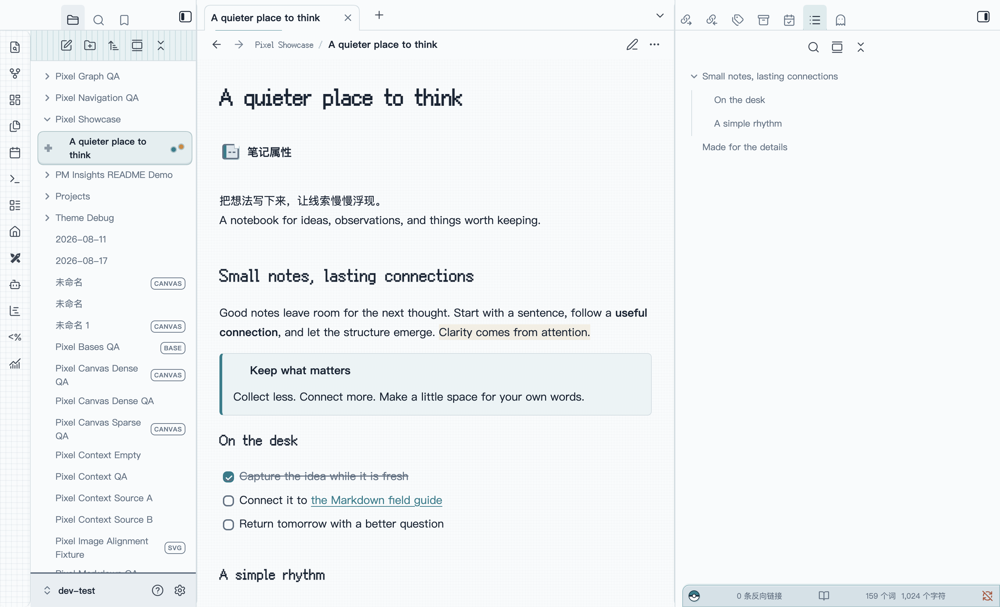
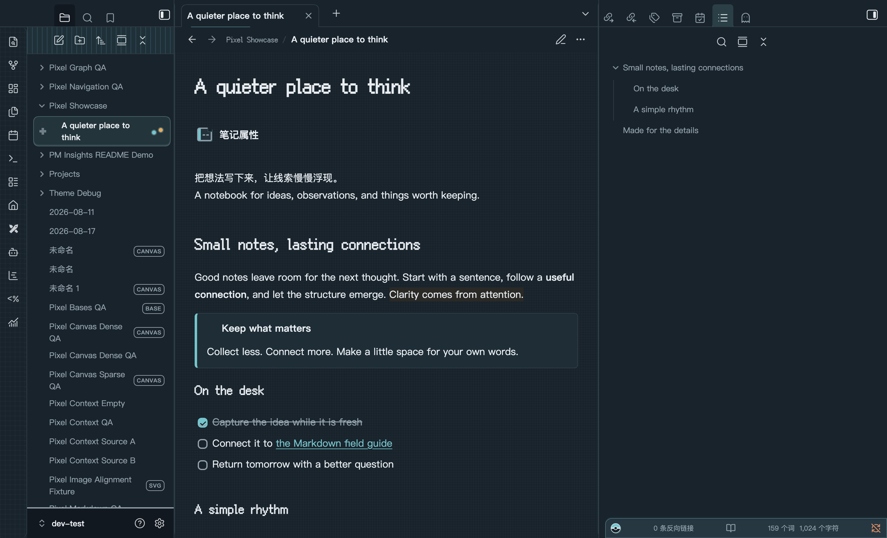

<h1 align="center">P I X E L</h1>

<p align="right">中文 · <a href="README.md">English</a></p>

<p align="center">
  <strong>纸上像素 · 专注写作</strong><br>
  一款为长文写作与知识管理设计的 Obsidian 主题
</p>

<p align="center">
  
</p>

<p align="center">
  <kbd><!-- pixel-version:start -->0.9.1<!-- pixel-version:end --></kbd>
  <kbd>OBSIDIAN 1.12+</kbd>
  <kbd>LIGHT / DARK</kbd>
  <kbd>DESKTOP / iOS</kbd>
</p>

<p align="center">
  <a href="#成果预览">成果预览</a> ·
  <a href="#主题特点">主题特点</a> ·
  <a href="#安装">安装</a> ·
  <a href="#开发">开发</a>
</p>

<p align="center">
  
</p>

<p align="center"><sub>桌面 Light / Dark 与 iOS · 使用真实 Obsidian 界面合成</sub></p>

Pixel 以冷静的纸张界面承载内容，把像素字体留给标题和少量身份元素。它不是给 Obsidian 套上一层复古滤镜，而是在保留原生交互的前提下，让文件导航、笔记阅读、属性编辑和数据视图拥有清晰、稳定且容易辨认的层级。

主题覆盖桌面端与 iOS，提供完整的浅色、深色方案，并针对中英文混排、长篇 Markdown、Bases、Canvas、Graph 和 PDF 等常用工作流进行了统一设计。Android 目前属于未验证平台，不作支持承诺。

## 成果预览

### 桌面端 · Light / Dark

桌面端使用连续的 Paper 工作平面：左侧负责导航，中央保持宽阔阅读区，当前文件、属性和状态通过青色信号建立关联。

<details>
<summary>展开查看浅色与深色完整对照</summary>

<table>
  <tr>
    <td align="center"><strong>LIGHT</strong></td>
    <td align="center"><strong>DARK</strong></td>
  </tr>
  <tr>
    <td></td>
    <td></td>
  </tr>
</table>

</details>

## 主题特点

| 特点 | 说明 |
| --- | --- |
| 像素身份 | Fusion Pixel 用于笔记标题与 H1–H3，保留鲜明个性，同时避免正文阅读疲劳。 |
| 纸张阅读 | 正文使用适合长文的字体栈、`72ch` 默认行宽和克制的背景层级。 |
| 语义配色 | 青色表示导航与焦点，琥珀色表示上下文与强调，砖红色表示警告与危险状态。 |
| 桌面工作区 | 左侧导航、中央笔记和右侧上下文区域形成连续、清晰的工作平面。 |
| 移动端适配 | 为手机重新调整标题、文件列表、笔记属性、抽屉和底部导航的比例，而不是简单缩小桌面界面。 |
| 原生优先 | 不替换 Obsidian 的编辑、折叠、滚动、手势、抽屉、SVG 图标或媒体控制。 |

## 视觉语言

Pixel 使用一套固定的视觉语法，让状态不仅依赖颜色表达：

- **Paper**：笔记、菜单和主要阅读区域使用安静的纸张表面。
- **Canvas**：工作区外围使用冷灰画布，帮助内容区域建立边界。
- **Cyan**：当前文件、链接、插入光标和键盘焦点的主信号。
- **Amber**：属性、上下文信息与需要注意的内容。
- **Brick**：错误、警告和破坏性操作。
- **4 / 6 / 10px 圆角体系**：兼顾 Pixel 的结构感和现代触控界面的舒适度。

浅色与深色模式使用独立调校的语义颜色，而不是简单反相。正文、次要文字、焦点和有意义的控件边界均以可访问对比度为基线。

## 支持的 Obsidian 界面

### Markdown 写作

- Source、Live Preview 与 Reading 三种模式保持一致的标题节奏。
- 支持链接、强调、列表、引用、任务、标签、高亮和脚注。
- 代码块、表格、嵌入内容和媒体在需要时保留局部滚动，不挤压整篇笔记。
- 选区、光标、当前行、折叠与缩进状态保持清晰可见。

### 知识管理

- 文件导航、标签、搜索、书签、大纲、反向链接和出链。
- 笔记属性与属性建议菜单，包括移动端编辑状态。
- Graph 与 Local Graph 的节点、连线和语义状态。
- Canvas 的卡片、分组、媒体、边、选择和编辑界面。
- Bases 的表格、列表、卡片、筛选、排序和属性编辑。
- PDF 工具栏、侧栏、缩略图、搜索与选区；文档页面本身保持原始显示。

### 桌面与 iOS

桌面端强调连续工作区和长时间阅读；iOS 则保留 Obsidian 原生双抽屉、系统返回、软键盘调整和安全区域行为，并为触摸操作提供至少 `44px` 的目标尺寸。Android 尚未完成实体设备验证。

Pixel 的移动布局由 Obsidian 原生 `body.is-mobile` 状态触发，不使用窗口宽度猜测设备类型。

## 安装

Pixel 从 `0.9.0` 开始进入公开公测。在官方目录审核通过后，可在 Obsidian 的「设置 → 外观 → 主题」中搜索 **Pixel** 安装；审核完成前可以使用手动安装。

### 社区主题目录

1. 打开 Obsidian「设置 → 外观」。
2. 在主题区域选择「管理」。
3. 搜索 **Pixel**，选择安装并使用。

后续公开版本会通过 Obsidian 内置主题更新机制从 GitHub Release 自动获取。

### 手动安装

1. 下载仓库根目录中的 [`manifest.json`](manifest.json) 和 [`theme.css`](theme.css)。
2. 在你的 Vault 中创建目录：

   ```text
   .obsidian/themes/Pixel/
   ```

3. 将两个文件复制到该目录：

   ```text
   .obsidian/themes/Pixel/manifest.json
   .obsidian/themes/Pixel/theme.css
   ```

4. 重新打开 Obsidian，进入「设置 → 外观 → 主题」，选择 **Pixel**。

在 iOS 上使用同步 Vault 时，请等待 `.obsidian/themes/Pixel/` 完成同步；如果主题没有立即出现，可完全退出并重新打开 Obsidian。Android 当前为未验证平台。

## 个性化

Pixel 尊重 Obsidian 自身的外观设置，无需配套插件即可调整：

- 浅色或深色模式
- 正文字体与界面字体
- 基础字号
- 强调色

Pixel 当前不提供额外的 **Style Settings** 自定义项；安装、使用和调整主题均不依赖 Style Settings 插件。

主题内置以下字体资源：

- **Fusion Pixel**：用于标题身份。
- **Obsidian 配置的等宽字体**：用于代码和技术状态，并使用系统等宽字体回退。
- **系统中文字体栈**：用于正文与长文阅读，稀有字符继续使用操作系统字体回退。

Pixel 不注入社区插件专用选择器。遵循 Obsidian 官方 CSS 变量的插件通常可以自然继承主题颜色与控件样式，但项目不对单个社区插件作兼容承诺。

## 可访问性

- 普通文本目标对比度不低于 `4.5:1`。
- 有意义的图标与控件边界目标对比度不低于 `3:1`。
- 键盘焦点同时使用轮廓、背景和位置提示，不只依赖颜色。
- 支持减少动态效果、强制颜色与增强对比度偏好。
- 支持 Obsidian 用户设置的字体、字号、强调色、选区与光标颜色。
- 长文本、代码和表格优先重排或局部滚动，避免隐藏内容与操作。

## 兼容性

| 项目 | 当前信息 |
| --- | --- |
| 当前版本 | <code><!-- pixel-version:start -->0.9.1<!-- pixel-version:end --></code> |
| Obsidian 要求 | `1.12.0` 或更高版本 |
| 已验证桌面环境 | Obsidian `1.13.4` / macOS |
| 移动端支持 | iOS |
| 暂未验证 | Android |
| 外观模式 | Light / Dark |
| 安装文件 | `manifest.json`、`theme.css` |
| 主题许可 | MIT |
| 内置字体许可 | SIL Open Font License 1.1 |

## 开发

### 环境要求

- Node.js 24
- npm

安装依赖并验证主题：

```sh
npm ci
npm run build
npm test
npm run check
```

- `npm run build`：编译 `theme.css`，并在配置了开发 Vault 时部署主题。
- `npm run dev`：监听 Sass 源文件并持续构建。
- `npm test`：执行主题结构、兼容性和发布契约测试。
- `npm run check`：确认生成文件与源码一致，不修改文件。

`src/scss/index.scss` 是唯一 Sass 入口。请修改 `src/` 下的源模块，不要直接编辑根目录中生成的 `theme.css`。

### 部署到开发 Vault

复制 `.env.example` 为 `.env`，把 `OBSIDIAN_THEME_DIR` 设置为专用测试 Vault 中 Pixel 主题目录的绝对路径：

```sh
OBSIDIAN_THEME_DIR=/absolute/path/to/dev-test/.obsidian/themes/Pixel npm run build
```

构建脚本只会原子替换目标目录中的 `theme.css` 和 `manifest.json`，并拒绝相对路径、符号链接、错误 Vault 和越界目标。

## 项目结构

```text
src/scss/             Sass 主题源码
src/assets/fonts/     内置字体、来源与许可证
src/assets/screenshots/ README 成果截图与像素视觉资源
test/                 主题与发布契约测试
docs/releases/        中英文版本说明
docs/RELEASING.md     长期发布与社区升级手册
manifest.json         Obsidian 主题清单
versions.json         版本兼容映射
theme.css             生成的可安装样式表
```

## 发布约束

- `manifest.json` 是主题版本的唯一权威来源。
- `theme.css` 是唯一生成的安装样式表。
- 发布标签必须与 `manifest.json` 中的版本完全一致。
- 主题运行时不加载远程字体或图片资源。
- 只有不带 `v` 前缀的 `x.y.z` tag 才触发 GitHub Release 工作流。
- 全部门禁通过后，工作流会公开正式 Release，并生成安装资产的构建来源证明。
- 已公开的 tag、Release 和安装资产不可覆盖；问题通过新 PATCH 版本前向修复。

完整操作步骤见[发布手册](docs/RELEASING.md)。

## 参与贡献

欢迎通过 [Issues](https://github.com/CoffeeCheese/obsidian-pixel-theme/issues) 报告显示问题、兼容性问题或提出改进建议，也欢迎提交 Pull Request。

报告视觉问题时，建议同时提供：

- Obsidian 与 Pixel 版本
- 操作系统和设备
- Light / Dark 模式
- 能复现问题的截图或最小笔记内容
- 是否启用了 CSS snippets 或社区插件

## 许可

Pixel 主题源码使用 [MIT License](LICENSE)。内嵌的 Fusion Pixel 字体继续遵循 SIL Open Font License 1.1；完整来源、校验信息和许可证位于 [`src/assets/fonts/`](src/assets/fonts/)。

---

[Read the complete English documentation](README.md).
